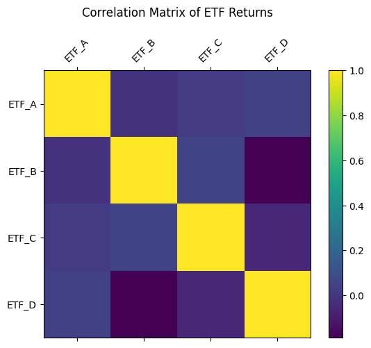
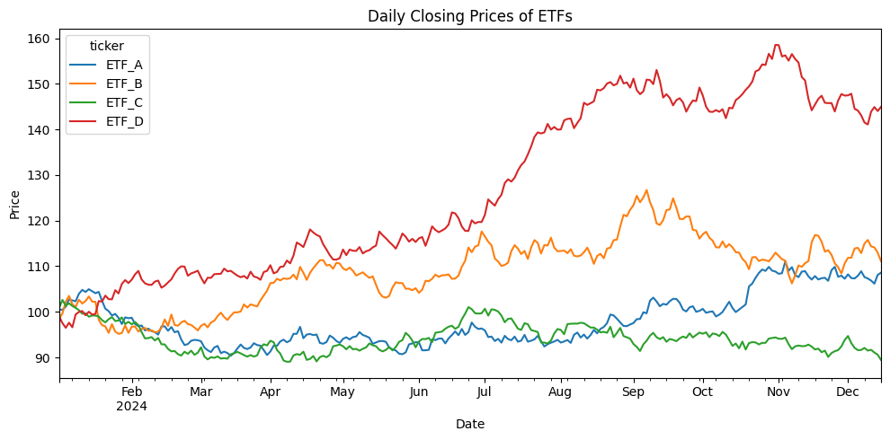
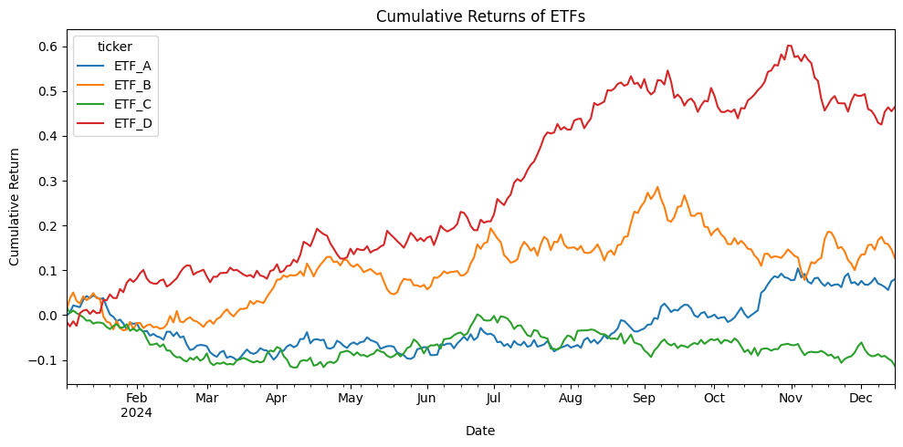

# Python Financial Data Analysis Mini Project

This project performs an exploratory data analysis (EDA) on a synthetic financial dataset containing daily closing prices for four exchange-traded funds (ETFs): **ETF_A, ETF_B, ETF_C, ETF_D**.  
The goal is to demonstrate skills in **Python, data cleaning, visualization, time-series analysis, returns, and correlations**.

---

## 📁 Files in This Repository
- **python_financial_data_analysis.ipynb** — Main Jupyter Notebook performing the analysis  
- **financial_data.csv** — Synthetic price dataset (250 trading days × 4 tickers)  
- **README.md** — Project explanation and documentation  

---

## 🔧 Tools & Libraries
- Python  
- Pandas  
- NumPy  
- Matplotlib  
- (Optional) Seaborn  

---

## 📊 Analysis Performed
- Importing and cleaning financial price data  
- Pivoting data into time-series format  
- Visualizing ETF price trends  
- Calculating daily percentage returns  
- Return summary statistics  
- Correlation matrix (heatmap)  
- Distribution of returns  
- Cumulative return comparison  
- Identifying best-performing ETF  

---

## 📈 Example Insights
(You can modify these after running the notebook.)

- Highest-return ETF over the full period  
- Lowest volatility ETF  
- Strongest correlations between asset returns  
- ETF performance divergence over time  

---

## 🧩 Purpose of This Project
This project is designed to showcase:
- Python proficiency  
- Data analysis workflow  
- Time-series concepts  
- Visualization and reporting skills  
- Finance-oriented quantitative thinking  

Perfect for use in:
- **CV / Resume Projects Section**  
- **Internship applications**  
- **Master’s programs (Finance, Analytics, IE, OR)**  

---
## Visualizations

  
  
  
  

## 📌 Author
**Rahmi Berkay Alp**  
Sabancı University  
